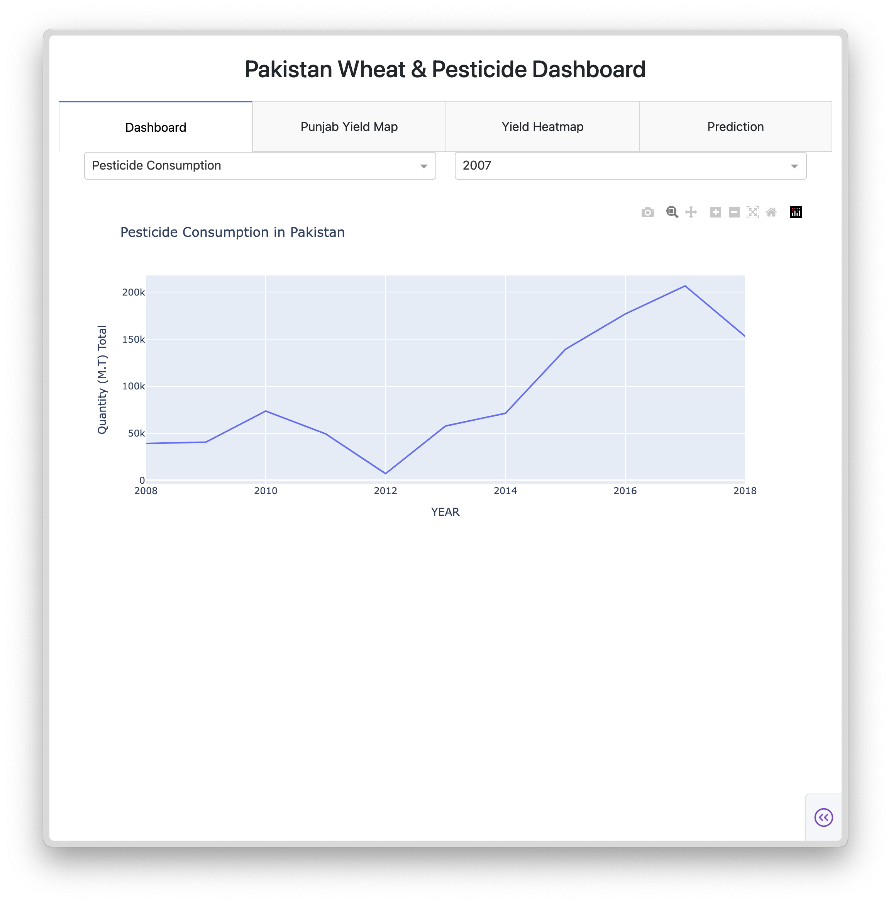
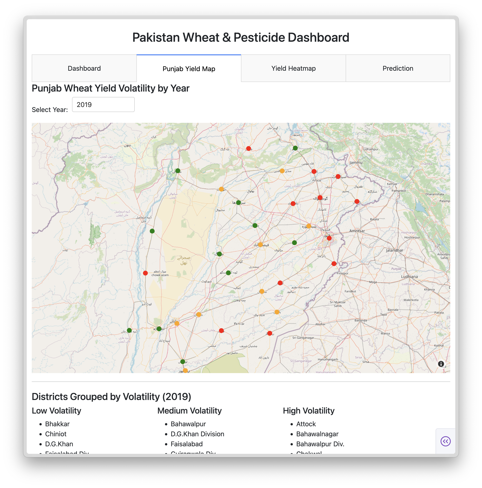
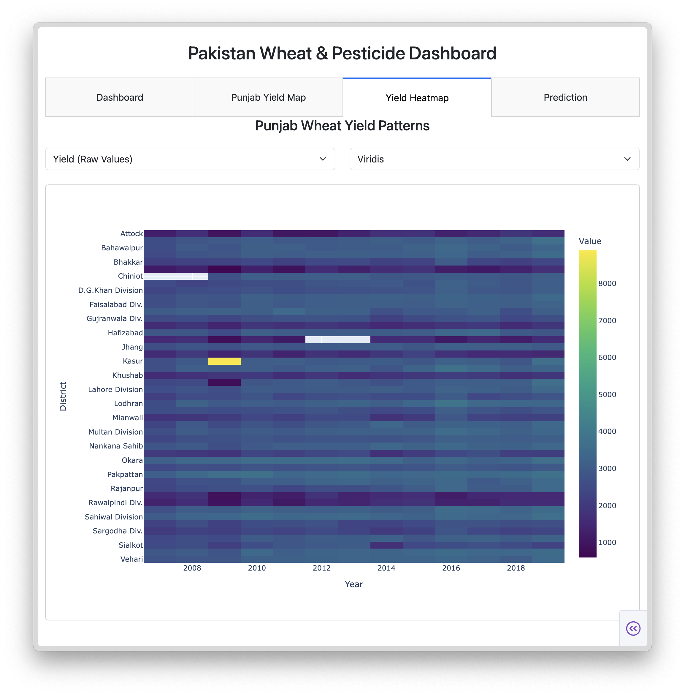
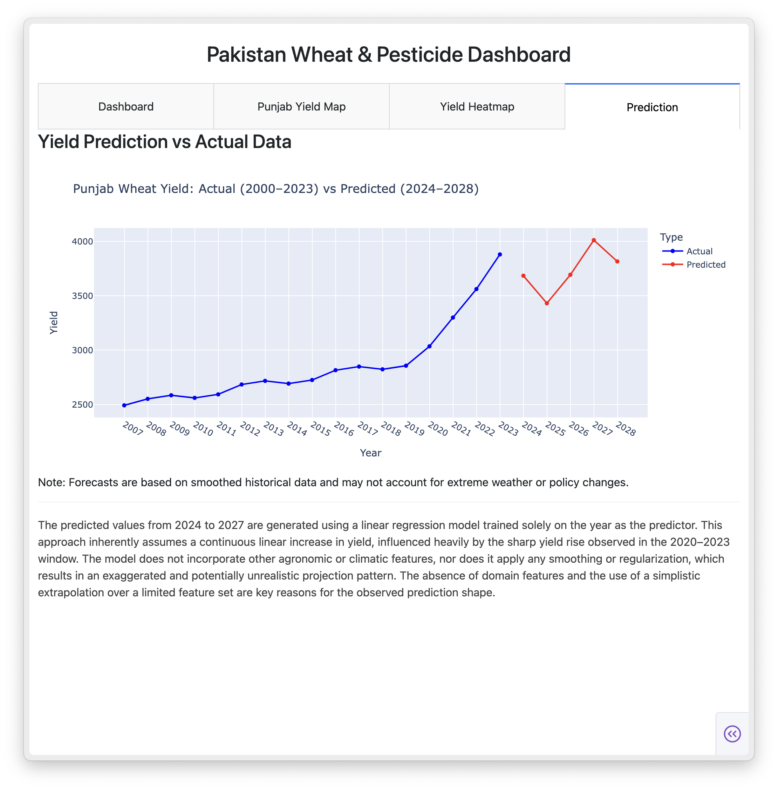

# Pakistan Wheat & Pesticide Dashboard

## Project Overview
This repository contains a Dash-based dashboard for analyzing wheat yield and pesticide consumption data in Pakistan, with a focus on Punjab. The project includes data loading, visualization, and forecasting capabilities.

## File Descriptions
- **dashboard_tab.py**: Defines the layout for the dashboard tab, including dropdowns for selecting views (Pesticide Consumption or Wheat Yield by District) and years, and a graph output area.
- **map_tab.py**: Creates a layout for a map tab displaying Punjab wheat yield volatility by year, with a dropdown for year selection, a scatter mapbox plot, and a section for volatility categories.
- **callbacks.py**: Contains callback functions to handle tab switching and graph updates based on user selections, integrating data from pesticide and yield datasets.
- **layout.py**: Sets up the overall dashboard layout with a title, tabs (Dashboard, Punjab Yield Map, Yield Heatmap, Prediction), and a dynamic content area.
- **heatmap_tab.py**: Defines a layout for a heatmap tab showing Punjab wheat yield patterns, with options to select metric (raw yield, normalized yield, or volatility) and color scale, and includes a callback to update the heatmap.
- **main.py**: Initializes the Dash application, applies a Bootstrap theme, sets the layout, registers callbacks, and runs the app in debug mode.
- **data_loader.py**: Provides functions to load and clean pesticide and yield data, compute yearly volatility, categorize volatility levels, and prepare volatility data with coordinates.
- **yield_forecaster.py**: Implements a Prophet model to forecast Punjab wheat yield for the next 10 years based on historical data, saves the forecast to a CSV file, and prints the results.
- Flowchart files explain everything in more detail.

## 📸 Dashboard Screenshots

### 1. 🧭 Main Dashboard Interface

### 2. 📍 Punjab Yield Volatility Map

### 3. 🌾 Yield Heatmap

### 4. 📈 Yield Prediction (Actual vs Forecasted)

---

## 📚 Data Sources

- **Early Wheat Yield Data (District-wise)**:  
  [Open Data Punjab - Wheat Yield Dataset](https://opendata.com.pk/dataset/area-sown-production-and-yield-per-hectare-of-wheat-by-districts-punjab/resource/5871026e-1918-43b4-b7ba-7578bdcd4123)

- **Recent Wheat Yield Statistics (2021–22)**:  
  [Government of Punjab - Rabi Final Report 2021–22 (PDF)](https://crs.agripunjab.gov.pk/urdu/system/files/12-Book%20Rabi%20Final%202021-22.pdf?utm_source=chatgpt.com)

---

## Usage
- Run `main.py` to launch the dashboard.
- Ensure required data files (e.g., `Pesticide Consumption Pakistan 2008-2018.csv`, `Wheat Yield by Districts Punjab.csv`, `Punjab_District_Coord.csv`) are in the `data/` directory.
- Install dependencies (e.g., Dash, Plotly, Prophet) before running.

## Notes
- The project was last updated on July 17, 2025.